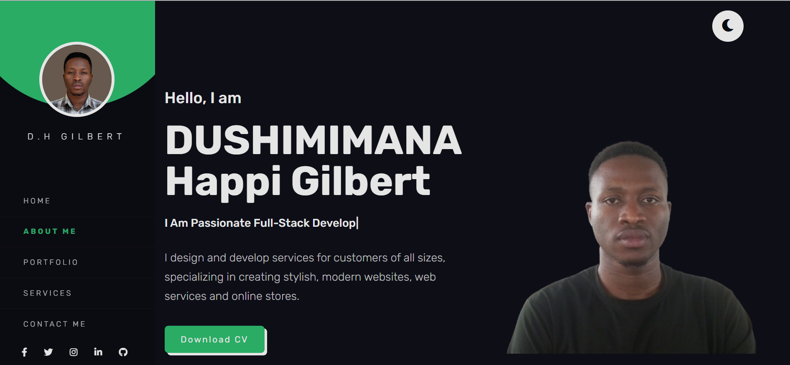
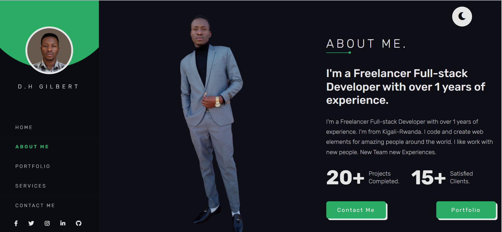
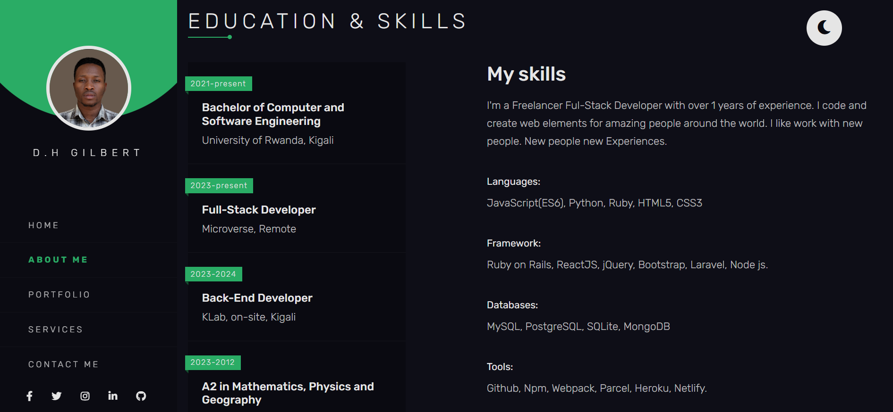
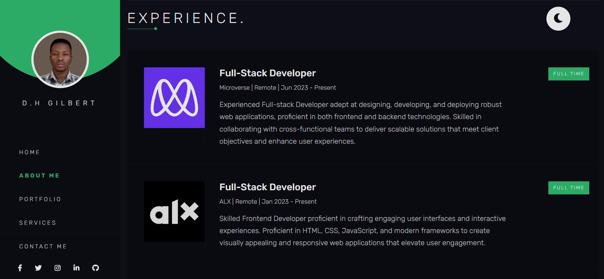
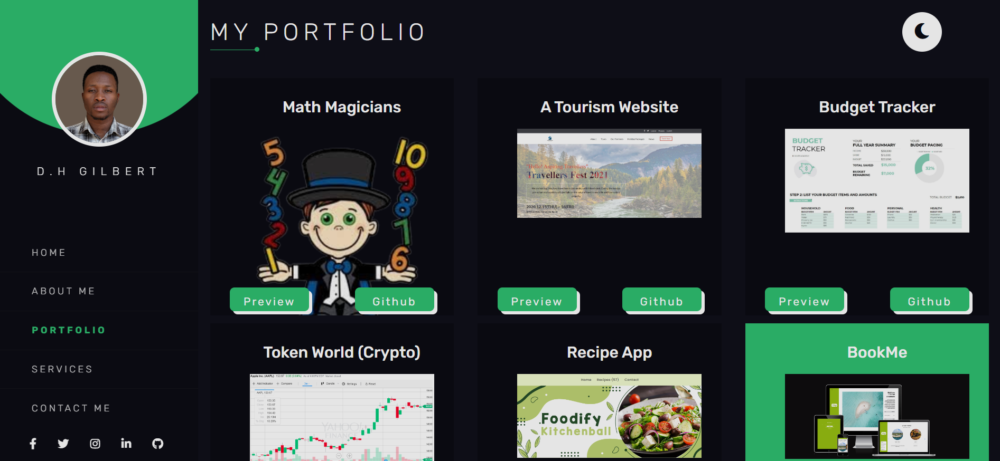
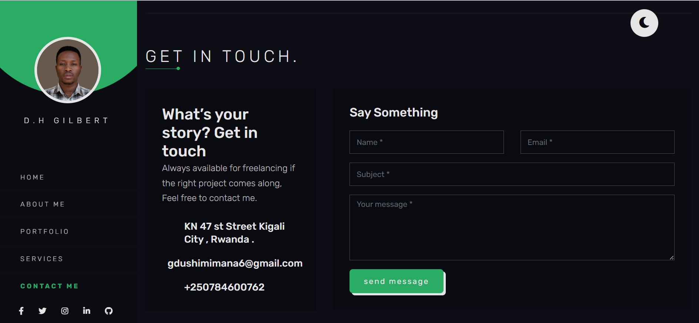

<!--
!!! IMPORTANT !!!
This README is an example of how you could professionally present your codebase. 
Writing documentation is a crucial part of your work as a professional software developer and cannot be ignored. 

You should modify this file to match your project and remove sections that don't apply.

REQUIRED SECTIONS:
- Table of Contents
- About the Project
  - Built With
  - Live Demo
- Getting Started
- Authors
- Future Features
- Contributing
- Show your support
- Acknowledgements
- License

OPTIONAL SECTIONS:
- FAQ

After you're finished please remove all the comments and instructions!

For more information on the importance of a professional README for your repositories: https://github.com/microverseinc/curriculum-transversal-skills/blob/main/documentation/articles/readme_best_practices.md
-->

  <!-- You are encouraged to replace this logo with your own! Otherwise you can also remove it. -->
  
   

  <h3><b>Portfolio</b></h3>

<!-- TABLE OF CONTENTS -->

# 📗 Table of Contents

- [📖 About the Project](#about-project)
  - [🛠 Built With](#built-with)
    - [Tech Stack](#tech-stack)
    - [Key Features](#key-features)
- [💻 Getting Started](#getting-started)
  - [Prerequisites](#prerequisites)
  - [Setup](#setup)
  - [Install](#install)
  - [Usage](#usage)
- [👥 Authors](#authors)
- [🔭 Future Features](#future-features)
- [🤝 Contributing](#contributing)
- [⭐️ Show your support](#support)
- [🙏 Acknowledgements](#acknowledgements)
- [❓ FAQ (OPTIONAL)](#faq)
- [📝 License](#license)

<!-- PROJECT DESCRIPTION -->

# 📖 Portfolio: desktop version and Mobile version

> This project is about creating portfolio by using figma

**Portfolio: desktop version** is a project of html headings and css stylings of 
finish mobile version

## 🛠 Built With 

# Portfolio - live Demo.
  

  # Screenshots from Desktop version.
  
   
    
     
      
       
       
  ## Built With
- HTML
- CSS
- React

## Key Features
 Feature 1:Portfolio: preserve data in the browser

## Future Features
Feature 1: A real-time chat application with support for multiple users.

<!-- AUTHORS -->

## 👥 Authors 

👤 **Happi**
- GitHub: [@githubhandle](https://github.com/gilberthappi)
- Twitter: [@twitterhandle](https://twitter.com/DushimimanaGil3)
- LinkedIn: [LinkedIn](https://www.linkedin.com/in/dushimimana-gilbert-happi/)

(<a href="#readme-top">back to top</a>)

<!-- CONTRIBUTING -->

## 🤠Contributing 

Contributions, issues, and feature requests are welcome!

Feel free to check the [issues page](../../issues/).

(<a href="#readme-top">back to top</a>)

<!-- SUPPORT -->

## ⭐️ Show your support 

If you like this project...leave a star⭐️

(<a href="#readme-top">back to top</a>)

<!-- ACKNOWLEDGEMENTS -->

## 🙠Acknowledgments 

I would like to thank Robert

(<a href="#readme-top">back to top</a>)

<!-- FAQ (optional) -->

## ❓ FAQ (OPTIONAL) 

- **HTML and CSS is good?**

YEs
- **Heading and Styling is needed?**

YEs

(<a href="#readme-top">back to top</a>)

<!-- LICENSE -->

## 📠License 

This project is [MIT](./LICENSE)  licensed.

(<a href="#readme-top">back to top</a>)

